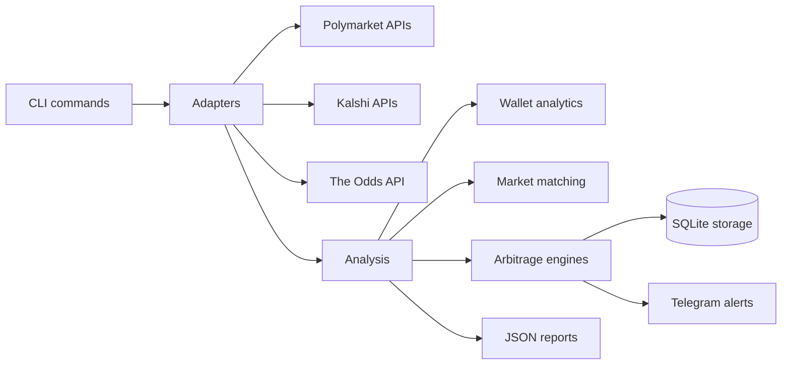

# Polylens

Polylens is a wallet intelligence and arbitrage research platform for prediction markets and sportsbook odds. It analyzes Polymarket wallet activity, compares related markets across Polymarket and Kalshi, scans sportsbook lines and player props for pricing discrepancies, stores opportunities, and can continuously monitor for new prop arbitrage.

Polylens is intended for research, analytics, and monitoring. It does not execute trades or place sportsbook bets.

## Features

- Wallet analytics for Polymarket addresses
- Prediction market analysis across Polymarket and Kalshi
- Market inventory and matching diagnostics
- Sportsbook odds ingestion via The Odds API
- Sportsbook futures and multibook arbitrage analysis
- Player prop arbitrage scanning for common NBA props
- Continuous monitoring with duplicate suppression
- SQLite opportunity persistence
- Telegram alerting for qualifying prop opportunities
- CLI-first workflows suitable for servers and systemd

## Architecture



See [docs/architecture.md](docs/architecture.md) for a fuller module map.

## Installation

### Local

```bash
python -m venv .venv
source .venv/bin/activate
pip install -r requirements.txt
```

If `requirements.txt` is not present in your checkout yet, install the small runtime/test set used by the project manually and then run `pytest` to verify the environment.

### Environment Variables

```text
ODDS_API_KEY          Required for sportsbook odds, futures, and player props.
TELEGRAM_BOT_TOKEN   Optional for Telegram alerts.
TELEGRAM_CHAT_ID     Optional for Telegram alerts.
```

Other deployment-specific values may be placed in the systemd env file described in [docs/deployment_systemd.md](docs/deployment_systemd.md).

## Quick Start

```bash
python -m src.cli analyze-wallet 0x0000000000000000000000000000000000000000
python -m src.cli compare-kalshi 0x0000000000000000000000000000000000000000
python -m src.cli scan-prop-arb --sport basketball_nba --markets player_points --bankroll 1000 --json
python -m src.cli watch-prop-arb --sport basketball_nba --markets player_points --interval 30 --bankroll 1000 --min-roi 0.01
```

## Testing

```bash
pytest
```

## Roadmap

See [docs/roadmap.md](docs/roadmap.md).

## Security

Do not commit API keys, Telegram credentials, webhook URLs, private wallet notes, or raw data containing sensitive account information. See [SECURITY.md](SECURITY.md) and [docs/security.md](docs/security.md).

## License

A license has not been selected yet. See [docs/license_recommendation.md](docs/license_recommendation.md) for recommended options and tradeoffs.
