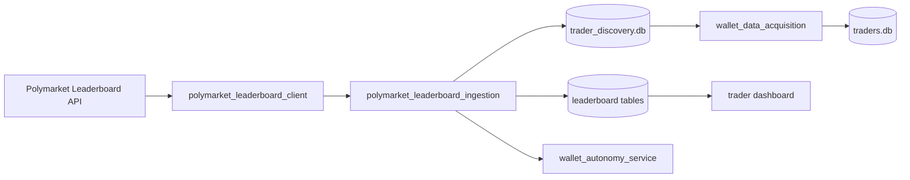

# Polymarket Leaderboard Ingestion Plan

Branch: `feature/polymarket-leaderboard-ingestion`

## Mission

Automatically discover real wallets from public Polymarket leaderboard / top-trader data instead of depending primarily on manually seeded wallets.

## Constraints

- Public data only (`GET https://data-api.polymarket.com/v1/leaderboard`)
- Read-only analytics
- Paper-only
- No credentials, execution, order placement, or live trading

## Public API

| Parameter | Values |
|---|---|
| `category` | `OVERALL`, `POLITICS`, `SPORTS`, `CRYPTO`, … |
| `timePeriod` | `DAY`, `WEEK`, `MONTH`, `ALL` |
| `orderBy` | `PNL`, `VOL` |
| `limit` | 1–50 |
| `offset` | pagination |

Response entries include `rank`, `proxyWallet`, `userName`, `vol`, `pnl`.

## Architecture

## Deliverables

| # | Component | Module |
|---|---|---|
| 1 | Leaderboard client | `src/intelligence/polymarket_leaderboard_client.py` |
| 2 | Wallet extraction | `polymarket_leaderboard_ingestion.extract_leaderboard_wallets` |
| 3 | Acquisition integration | `LeaderboardAcquisitionSource` in `wallet_data_acquisition.py` |
| 4 | Registry integration | Acquisition pipeline → `save_wallet_report` |
| 5 | Discovery integration | `LeaderboardDiscoverySource` in `wallet_discovery.py` |
| 6 | Autonomy integration | `leaderboard_ingestion` cycle in `wallet_autonomy_service.py` |
| 7 | CLI commands | `polymarket-leaderboard-fetch`, `-ingest`, `-health`, `-status` |
| 8 | Dashboard visibility | Acquisition page leaderboard health section |
| 9 | Full tests | `tests/test_polymarket_leaderboard.py` |
| 10 | Validation report | `reports/polymarket_leaderboard_ingestion_validation_report.md` |

## Synthetic Wallet Rejection

Leaderboard wallets pass through `wallet_synthetic_filter` before discovery or acquisition. Known fixtures (`0xaaaa…`, `0xbbbb…`) and repeated-character addresses are rejected.

## Success Criteria

- Real wallets automatically discovered from leaderboard fetches
- Synthetic wallets rejected with tracked counts
- Leaderboard wallets enter acquisition pipeline via `polymarket_leaderboard` source
- Autonomy service runs `leaderboard_ingestion` cycle safely
- Dashboard shows leaderboard source health
- Full test suite passes
