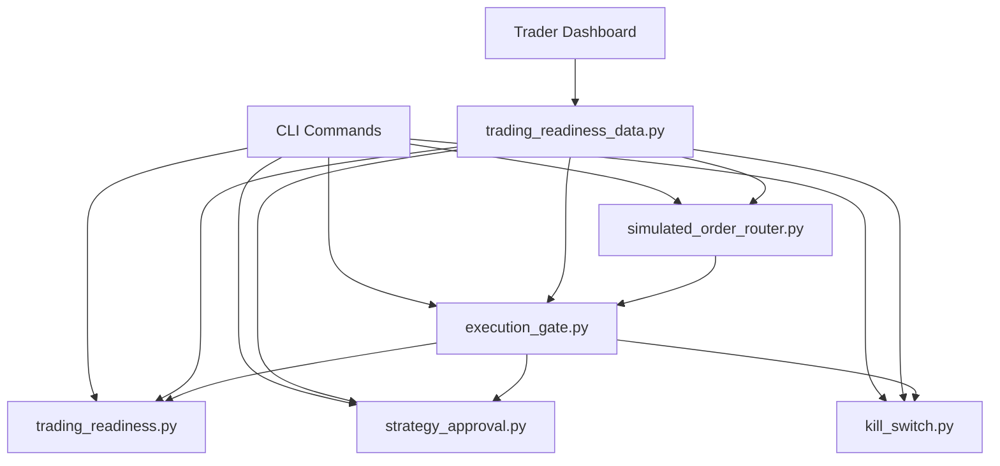

# Trading Readiness Framework — Validation Report

Branch: `feature/trading-readiness-framework`

Date: 2026-06-15

## Summary

The trading readiness framework prepares Polylens for future live execution while keeping all paths blocked by default. Live trading remains disabled; human approval, readiness checks, execution gates, kill switch, and simulated routing are in place.

## Architecture



## Readiness Model

`TradingReadinessReport` evaluates:

- Live flags default to paper-only (`DRY_RUN=true`, `LIVE_TRADING=false`)
- Strategy validation and approval status
- Minimum paper sample size, win rate, ROI, drawdown
- Alpha confidence (warning when below threshold)
- Risk engine health and configured limits
- Kill switch availability
- Credential presence only (never values)

Default result: `ready=false` with blockers.

## Safety Gates

`execution_gate.py` blocks live execution unless **all** conditions are true:

| Check | Default |
|---|---|
| `LIVE_TRADING=true` | false |
| `DRY_RUN=false` | false (DRY_RUN=true) |
| `POLYLENS_CONFIRM_RISK_ACK=true` | false |
| Approved strategy ID | not set |
| Readiness report passed | false |
| Daily loss cap configured | env-dependent |
| Max position size configured | env-dependent |
| Kill switch healthy | true |
| Fresh market data | true |
| No duplicate position | true |
| No open SRE incident | true |

Default gate result: **BLOCKED**.

## Approval Process

`strategy_approval.py` stores approvals in SQLite (`data/trading_readiness.db`):

- `strategy_id`, `approval_status`, `approved_at`, `approved_by`
- `max_capital`, `max_position_size`, `allowed_markets`, `expiration`, `notes`

CLI: `strategy-approve`, `strategy-revoke`, `strategy-approvals`

No strategy can pass the execution gate without an approved registry entry.

## Kill Switch

`kill_switch.py` supports:

- Global halt
- Strategy halt
- Wallet halt
- Market halt
- Resume with explicit reason

State persisted in SQLite. CLI: `trading-kill`, `trading-resume`, `trading-status`.

## Simulated Order Router

`simulated_order_router.py` records intended orders without external placement:

- Exchange, market, side, price, size
- Risk/gate decision and rejection reason
- Timestamp in `simulated_orders` table

CLI: `simulated-order`

## Dashboard

Read-only **Trading Readiness** section in the Trader Intelligence Center shows:

- Readiness status and blockers
- Approved strategies
- Kill switch state
- Simulated order log
- Live flags and risk limits

No controls to enable live trading.

## Systemd Safety

All autonomous `.service` units now include:

- `LIVE_TRADING=false`
- `DRY_RUN=true`
- `POLYLENS_LIVE_TRADING=false` (where applicable)

Tests in `tests/test_systemd_deployment.py` verify no unit submits live orders.

## Test Results

```
986 passed (full suite including trading readiness and systemd safety tests)
```

New coverage:

- `tests/test_trading_readiness.py` — readiness, gate, approval, kill switch, simulated router, CLI, dashboard data
- Extended `tests/test_systemd_deployment.py` — parametrized autonomous service safety checks

## Remaining Blockers Before Live Trading

This branch intentionally leaves live trading impossible without future explicit work:

1. Enable `LIVE_TRADING`, disable `DRY_RUN`, and set `POLYLENS_CONFIRM_RISK_ACK` (deliberately not done here)
2. Validate strategy with sufficient paper sample size and performance thresholds
3. Human approval via `strategy-approve`
4. Pass full readiness report with zero blockers
5. Pass execution gate with all checks true
6. Configure production risk limits and credentials via environment (not code/DB)
7. Operational runbook for kill switch and incident response
8. Wire execution gate into actual order executors (Kalshi/Polymarket) in a separate approved change

## Files Added/Modified

| Path | Purpose |
|---|---|
| `docs/TRADING_READINESS_FRAMEWORK_PLAN.md` | Phase 1 audit and plan |
| `src/trading/trading_readiness.py` | Readiness check engine |
| `src/trading/execution_gate.py` | Blocked-by-default execution gate |
| `src/trading/strategy_approval.py` | Strategy approval registry |
| `src/trading/simulated_order_router.py` | Dry-run order router |
| `src/trading/kill_switch.py` | Kill switch with SQLite persistence |
| `src/web/trading_readiness_data.py` | Dashboard data builder |
| `src/cli.py` | CLI commands |
| `src/web/trader_dashboard.py` | Read-only dashboard section |
| `deploy/systemd/*.service` | Safety env vars |
| `tests/test_trading_readiness.py` | Framework tests |
| `tests/test_systemd_deployment.py` | Systemd safety tests |
